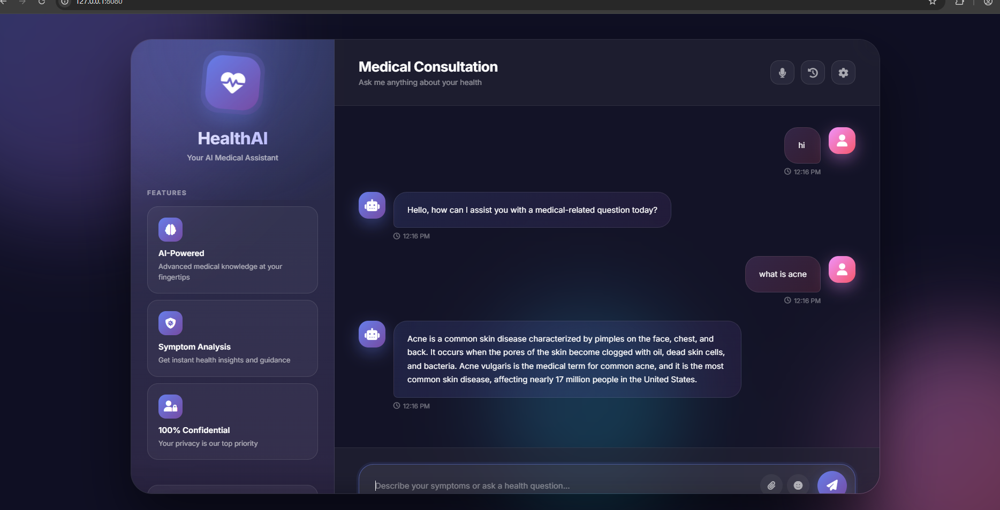

Medical Chatbot using **LangChain LLM** with **Groq API** to answer medical queries from documents.

## Features
- LLM-powered Q&A
- HuggingFace embeddings
- API keys securely handled
- PDF/document support

## Setup
```bash
git clone https://github.com/sneha-jagtap-patil/Medical_chatbot.git
cd Medical_chatbot
pip install -r requirements.txt
python app.py
open up localhost:
echstack Used:

    Python
    LangChain
    Flask
    GPT
    Pinecone
AWS-CICD-Deployment-with-Github-Actions.......
Login to AWS console.
Create IAM user for deployment
1. EC2 access : It is virtual machine

2. ECR: Elastic Container registry to save your docker image in aws
#About the deployment
1. Build docker image of the source code

2. Push your docker image to ECR

3. Launch Your EC2 

4. Pull Your image from ECR in EC2

5. Lauch your docker image in EC2
#Policy
1. AmazonEC2ContainerRegistryFullAccess

2. AmazonEC2FullAccess